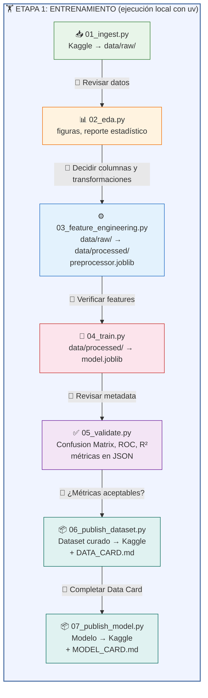
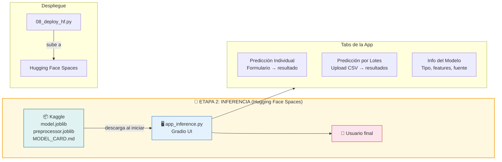
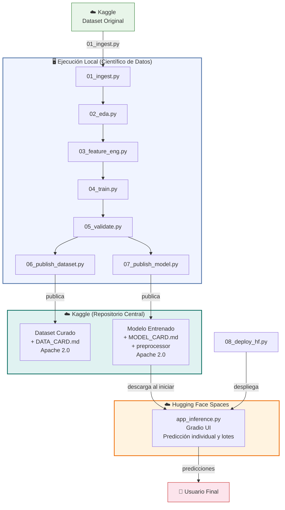
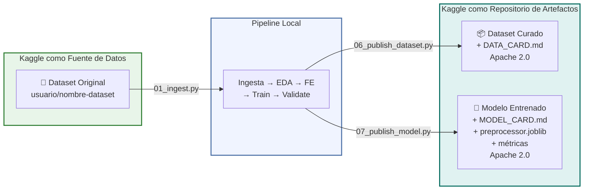
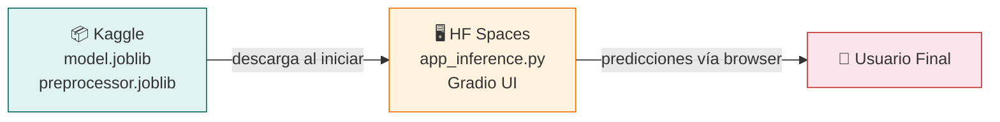
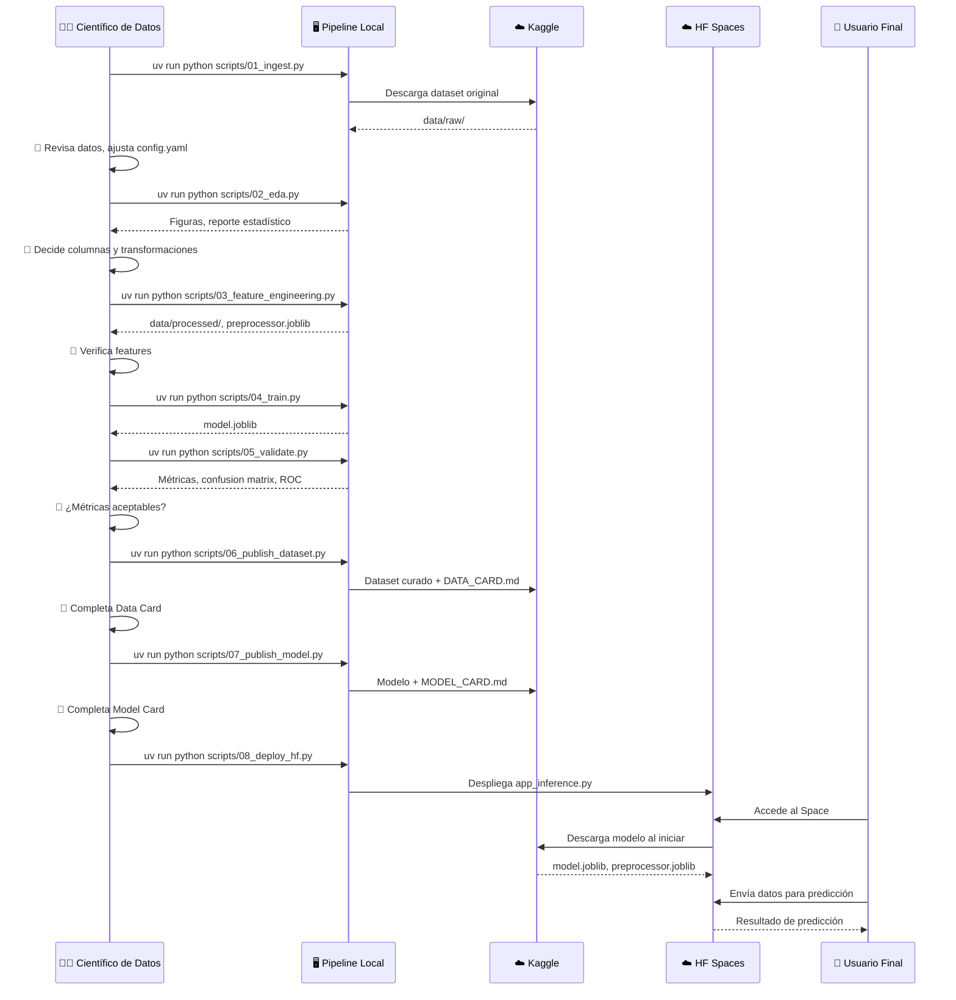
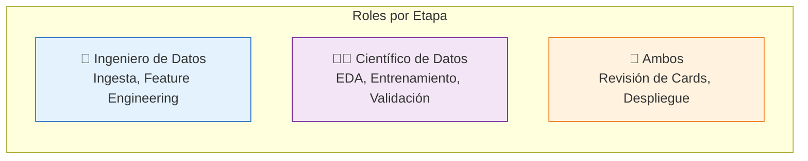

# Data Science Assistant — Arquitectura del Power

**Autor**: Gustavo De la Cruz Tovar
**Licencia**: Apache 2.0

---

## ¿Qué es este Power?

El **Data Science Assistant** es un Kiro Power que guía la construcción de aplicaciones de ciencia de datos de principio a fin. No es una librería ni un framework — es un conjunto de documentación, workflows y conexiones a servicios externos (MCP servers) que le enseñan al asistente de IA cómo estructurar, generar y desplegar proyectos de datos de forma profesional y reproducible.

## Estructura del Power

```
data-science-assistant/
├── POWER.md                                # Documento principal: principios, arquitectura, referencia
├── mcp.json                                # Configuración de 4 MCP servers
└── steering/                               # Guías detalladas por workflow
    ├── eda-feature-engineering.md           # EDA y Feature Engineering
    ├── model-training-validation.md         # Entrenamiento y validación
    ├── kaggle-workflows.md                  # Ingesta y publicación en Kaggle
    ├── gradio-interfaces.md                # Dos apps Gradio (training + inference)
    └── mlops-deployment.md                 # Pipelines, despliegue a HF Spaces
```

### POWER.md
Documento central que define los principios obligatorios del Power:
- Uso exclusivo de `uv` y `uvx` para gestión de entornos y paquetes
- Arquitectura modular de 8 scripts independientes
- Intervención humana entre cada etapa
- Dataset de Kaggle explícito como requisito previo
- Licenciamiento Apache 2.0 para todo artefacto publicado
- Estructura de directorios estándar para todo proyecto

### mcp.json
Configura cuatro MCP servers que el Power utiliza:

| MCP Server | Función |
|------------|---------|
| **Tavily** | Consulta documentación actualizada de pandas, numpy, sklearn, TensorFlow, PyTorch, etc. |
| **Kaggle** | Buscar/descargar datasets, publicar datasets curados y modelos entrenados |
| **Hugging Face** | Buscar modelos/datasets/Spaces, consultar docs de HF, gestionar Spaces |
| **Gradio Docs** | Documentación oficial de Gradio con schemas exactos de componentes |

### Steering Files
Guías detalladas que el asistente carga bajo demanda según la etapa en la que se encuentre el usuario. Cada archivo contiene código de referencia, patrones y gotchas para una fase específica del pipeline.

---

## Arquitectura de una Aplicación de Datos

El Power implementa una arquitectura de **dos etapas** con **dos aplicaciones** separadas:

### Etapa 1: Entrenamiento (local)

El científico de datos ejecuta un pipeline secuencial de 7 pasos. Cada paso es un script independiente que produce artefactos. Entre cada paso hay un punto de intervención humana donde se revisan resultados y se ajustan parámetros.



**Scripts y sus artefactos:**

| Script | Entrada | Salida | Descripción |
|--------|---------|--------|-------------|
| `01_ingest.py` | Kaggle dataset ref | `data/raw/` | Descarga datos desde Kaggle sin modificar |
| `02_eda.py` | `data/raw/` | `outputs/figures/`, `outputs/reports/` | Genera visualizaciones y reporte estadístico |
| `03_feature_engineering.py` | `data/raw/` | `data/processed/`, `models/preprocessor.joblib` | Transforma datos, guarda preprocessor |
| `04_train.py` | `data/processed/` | `models/model.joblib` | Entrena modelo, guarda serializado |
| `05_validate.py` | `models/model.joblib`, `data/processed/` | `outputs/metrics/`, `outputs/figures/` | Confusion matrix, ROC, R², métricas |
| `06_publish_dataset.py` | `data/processed/` | `cards/DATA_CARD.md` → Kaggle | Genera Data Card y publica dataset curado |
| `07_publish_model.py` | `models/` | `cards/MODEL_CARD.md` → Kaggle | Genera Model Card y publica modelo |

### Etapa 2: Inferencia (Hugging Face Spaces)

La app de inferencia se despliega como un Space público en Hugging Face. Descarga el modelo directamente desde Kaggle y expone una interfaz web para predicciones.



---

## Visión General: Dos Etapas Conectadas



---

## Dos Aplicaciones Gradio

### App Training (`app_training/app_training.py`)

- **Propósito**: Orquestar todo el pipeline de entrenamiento desde una interfaz visual
- **Usuario**: Científico de datos, ingeniero de datos
- **Ejecución**: Solo local — `uv run python app_training/app_training.py`
- **Nunca se despliega** a producción

La app tiene 7 tabs, uno por cada etapa del pipeline. El usuario ejecuta cada etapa secuencialmente, revisa los resultados en la misma interfaz, y decide cuándo avanzar.

| Tab | Etapa | Qué hace |
|-----|-------|----------|
| 1️⃣ Ingesta | `01_ingest` | Descarga dataset de Kaggle |
| 2️⃣ EDA | `02_eda` | Muestra distribuciones, correlaciones, faltantes |
| 3️⃣ Feature Engineering | `03_feature_eng` | Configura y ejecuta transformaciones |
| 4️⃣ Entrenamiento | `04_train` | Selecciona modelo, hiperparámetros, entrena |
| 5️⃣ Validación | `05_validate` | Muestra confusion matrix, ROC, métricas |
| 6️⃣ Publicar Dataset | `06_publish_ds` | Genera Data Card, prepara para Kaggle |
| 7️⃣ Publicar Modelo | `07_publish_mod` | Genera Model Card, prepara para Kaggle |

### App Inference (`app_inference/app_inference.py`)

- **Propósito**: Exponer el modelo entrenado como servicio de predicción
- **Usuario**: Usuario final (no técnico)
- **Ejecución**: Hugging Face Spaces (público)
- **Fuente del modelo**: Descarga desde Kaggle al iniciar

La app tiene 3 tabs:

| Tab | Qué hace |
|-----|----------|
| Predicción Individual | Formulario con inputs → predicción con probabilidades |
| Predicción por Lotes | Upload CSV → predicciones masivas → descarga resultados |
| Información del Modelo | Tipo de modelo, features, fuente en Kaggle |

---

## Rol de Kaggle y Hugging Face

### Kaggle: Repositorio de Datos y Modelos

Kaggle cumple dos funciones en esta arquitectura:

**1. Fuente de datos (entrada)**
- El pipeline comienza descargando un dataset de Kaggle (`01_ingest.py`)
- El usuario DEBE proporcionar la referencia explícita: `usuario/nombre-dataset`

**2. Repositorio de artefactos (salida)**
- El dataset curado (resultado de Feature Engineering) se publica en Kaggle con una **Data Card**
- El modelo entrenado se publica en Kaggle con una **Model Card**
- Kaggle es la **fuente de verdad** del modelo: la app de inferencia lo descarga de ahí



### Hugging Face: Plataforma de Despliegue

Hugging Face Spaces es donde se despliega la app de inferencia para el usuario final.



**Actualización del modelo**: Publicar nueva versión en Kaggle → reiniciar el Space → la app usa el modelo actualizado automáticamente. No se necesita re-desplegar.

---

## Flujo Completo del Modelo



---

## Gestión de Entorno

Todo el proyecto usa `uv` como gestor de paquetes y entornos virtuales:

| Acción | Comando |
|--------|---------|
| Crear proyecto | `uv init mi-proyecto-ml` |
| Agregar dependencia | `uv add pandas scikit-learn` |
| Ejecutar script | `uv run python scripts/01_ingest.py` |
| Ejecutar CLI tool | `uvx kaggle datasets list -s "query"` |
| Login en HF | `uvx huggingface-cli login` |

Nunca se usa `pip install` directamente ni `python -m venv`. El `pyproject.toml` y `uv.lock` garantizan reproducibilidad.

---

## Configuración Centralizada

Todos los parámetros del proyecto viven en un único `config.yaml`. Los scripts leen este archivo y nunca tienen valores hardcodeados. Esto permite que el científico de datos ajuste parámetros entre etapas sin modificar código.

Parámetros clave:
- **data.kaggle_ref**: Referencia del dataset en Kaggle (obligatorio)
- **features.target**: Columna objetivo
- **features.numeric / categorical**: Columnas a procesar
- **model.type**: Tipo de modelo (random_forest, xgboost, tensorflow, pytorch)
- **model.output_format**: Formato de serialización (joblib, pickle, keras, pth)
- **publish.kaggle_username**: Usuario de Kaggle para publicación
- **publish.hf_username**: Usuario de HF para despliegue

---

## Data Card y Model Card

Todo artefacto publicado a Kaggle incluye una card descriptiva:

### Data Card (`cards/DATA_CARD.md`)
Documenta el dataset curado:
- Descripción y fuente original
- Composición (filas, columnas, tipos)
- Preprocesamiento aplicado
- Valores faltantes del dataset original
- Uso previsto y limitaciones
- Licencia Apache 2.0

### Model Card (`cards/MODEL_CARD.md`)
Documenta el modelo entrenado:
- Tipo de modelo y framework
- Datos de entrenamiento y features
- Métricas de evaluación
- Hiperparámetros
- Uso previsto y limitaciones
- Consideraciones éticas
- Instrucciones de uso
- Licencia Apache 2.0

Ambas cards se generan automáticamente con secciones `[COMPLETAR]` que el científico de datos debe revisar y completar antes de publicar.

---

## Intervención Humana

La arquitectura está diseñada para que la automatización y la intervención humana coexistan. Cada etapa produce artefactos visibles (CSVs, figuras, JSONs, cards) que el equipo revisa antes de avanzar.



| Entre etapas | Qué revisa el humano |
|-------------|---------------------|
| Ingesta → EDA | ¿Los datos descargados son correctos? ¿Formato esperado? |
| EDA → Feature Eng. | ¿Qué columnas usar? ¿Hay outliers que tratar? ¿Qué transformaciones? |
| Feature Eng. → Train | ¿El dataset procesado tiene sentido? ¿Las features son correctas? |
| Train → Validate | ¿El modelo converge? ¿Los parámetros son razonables? |
| Validate → Publish | ¿Las métricas son aceptables? ¿El modelo es suficientemente bueno? |
| Publish → Deploy | ¿Las cards están completas? ¿La app funciona localmente? |

Esta separación permite que diferentes roles participen en diferentes etapas: el ingeniero de datos en ingesta y feature engineering, el científico de datos en entrenamiento y validación, y ambos en la revisión de cards y despliegue.
