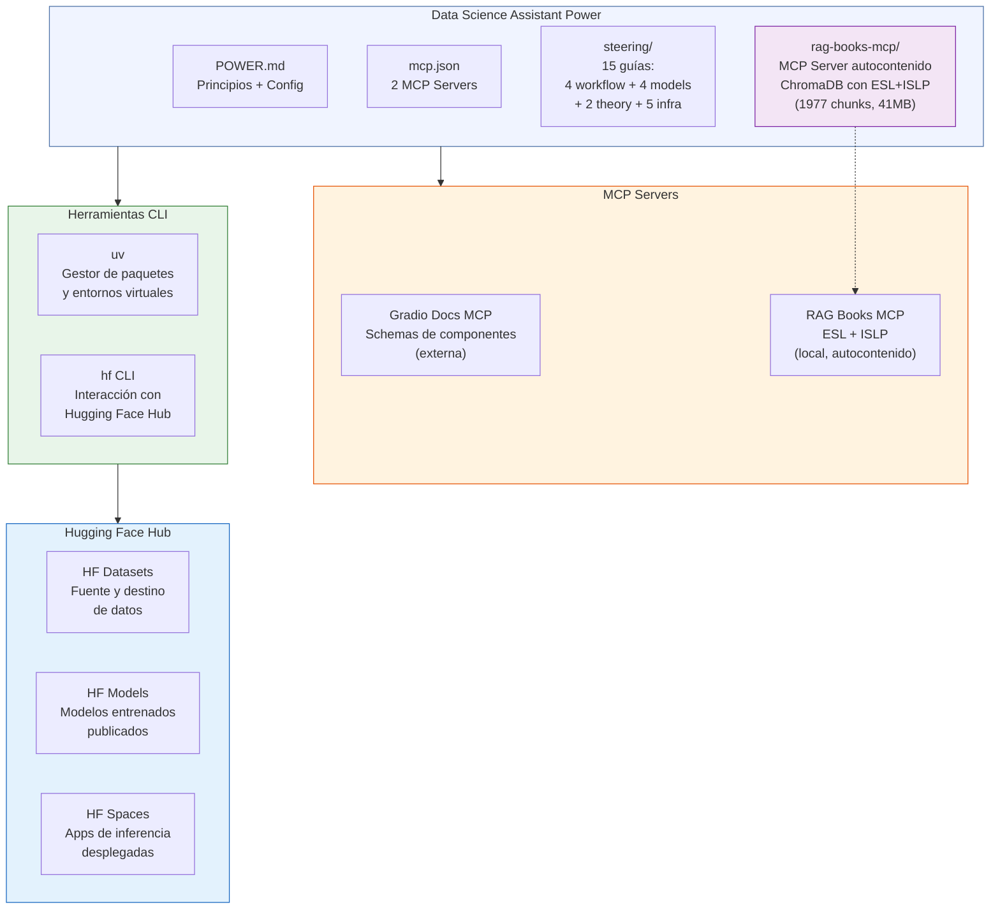
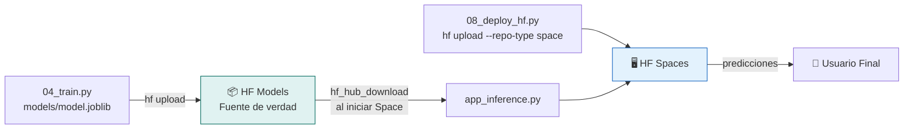
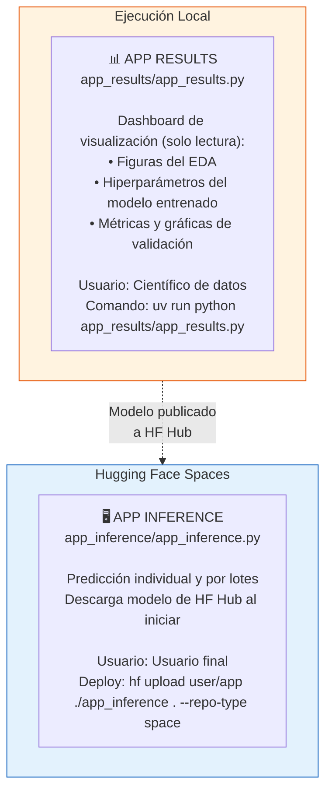

# Arquitectura del Power: Data Science Assistant

## Estructura del Power

```
data-science-assistant/
├── POWER.md                                # Documento principal: principios, arquitectura, referencia
├── mcp.json                                # Configuración de 2 MCP servers (Gradio Docs, RAG Books)
├── ARQUITECTURA.md                         # Este archivo
├── README.md                               # Guía de instalación y uso
├── rag-books-mcp/                          # MCP Server independiente (referenciado, no embebido)
│   # Soporta DOS variantes (mismas tools, distinto transporte):
│   #  A) HF Space (Gradio + mcp_server=True)  → URL pública, default recomendado
│   #  B) Git repo local (FastMCP por stdio)   → uso offline / auditoría
│   ├── pyproject.toml                      # Dependencias del server (chromadb, sentence-transformers, mcp, gradio[mcp])
│   ├── README.md                           # Documentación del RAG server con ambas variantes
│   ├── deploy_to_hf_space.py               # Despliegue al Space (variante A)
│   ├── hf-space/                           # Artefactos que sube el deploy (app.py, README.md, requirements.txt)
│   ├── rag_books_mcp/                      # Código fuente
│   │   ├── __init__.py
│   │   ├── tools.py                        # Lógica de las 4 tools (fuente única de verdad)
│   │   ├── server.py                       # Variante B · MCP Server stdio (FastMCP)
│   │   ├── app.py                          # Variante A · Gradio + mcp_server=True
│   │   └── ingest.py                       # Script de re-vectorización (opcional)
│   └── chroma_db/                          # Base vectorial pre-construida (41 MB, 1977 chunks)
│       ├── chroma.sqlite3                  # Metadata y documentos
│       └── [colecciones HNSW]              # Índices: esl_chapters, islp_chapters
└── steering/
    # Paso 0: contexto de negocio (BLOQUEANTE, antecede a todo lo demás)
    ├── business-context.md                  # Cuestionario corto + notes/00_business_context.md
    # Workflow (cómo ejecutar cada fase)
    ├── workflow-eda.md                      # Guía de Análisis Exploratorio
    ├── workflow-feature-engineering.md      # Feature Engineering, split, scaling, encoding
    ├── workflow-model-training.md           # Flujo común de entrenamiento (SMOTE, CV, GridSearch)
    ├── workflow-validation.md               # Métricas, calibración del umbral, benchmarking
    # Modelos por familia (heurísticas específicas)
    ├── models-linear-regression.md          # OLS, Ridge, Lasso, ElasticNet
    ├── models-trees-rf.md                   # Decision Trees, Random Forest, ExtraTrees
    ├── models-ensemble.md                   # Bagging, Boosting (XGBoost), Stacking
    ├── models-svm.md                        # LinearSVC, SVC kernels, OneClassSVM
    # Teoría (manual + protocolo)
    ├── theory-rag-guide.md                  # Cómo invocar rag-books-mcp (tools, citas, degradado)
    ├── theory-driven-design.md              # Protocolo: notes/0N_design_*.md ANTES de codificar
    # Infraestructura
    ├── huggingface-workflows.md             # Ingesta desde HF, publicación de datasets y modelos
    ├── gradio-interfaces.md                 # Dos apps Gradio: results (dashboard local) e inference (HF Spaces)
    ├── mlops-deployment.md                  # Despliegue a HF Spaces con CLI hf, estructura con uv
    ├── matplotlib-headless.md               # Backend Agg, persistencia de figuras a outputs/figures/
    └── notebooks-ds.md                      # Notebooks autocontenidos para Colab (badge, uv, model_info.json)
```

## Visión General

Este power orquesta el ciclo de vida completo de un proyecto de ciencia de datos usando **Hugging Face Hub** como plataforma central y el **CLI `hf`** como herramienta de interacción. No depende de MCP servers para operaciones con la plataforma — los MCP incluidos sirven para consultar documentación oficial (Gradio Docs) y para fundamentar decisiones con teoría (RAG Books sobre ESL/ISLP). La búsqueda web general se hace con las herramientas incorporadas del agente.

## Diagrama de Arquitectura General



## Pipeline Completo por Etapas

El pipeline se ejecuta como scripts independientes, precedidos por un **paso 0 bloqueante** de captura del contexto de negocio (cinco preguntas cortas que se materializan en `notes/00_business_context.md`). Entre cada etapa hay un punto de intervención humana (👤) donde el científico de datos revisa artefactos y decide si avanzar.

```mermaid
flowchart TD
    subgraph CONTEXTO["Paso 0: Contexto de Negocio (BLOQUEANTE)"]
        Z["📋 notes/00_business_context.md\n5 preguntas adaptadas al régimen\n(regresión / clasificación / multiclase)\n→ define métrica primaria y\ncosto asimétrico de errores"]
    end

    subgraph INGESTA["Etapa 1: Ingesta"]
        A["📥 01_ingest.py\nhf download → data/raw/"]
    end

    subgraph ANALISIS["Etapas 2-3: Análisis y Transformación"]
        B["📊 02_eda.py\n→ outputs/figures/"]
        C["⚙️ 03_feature_engineering.py\n→ data/processed/"]
    end

    subgraph MODELO["Etapas 4-5: Modelo"]
        D["🧠 04_train.py\n→ models/model.joblib"]
        E["✅ 05_validate.py\n→ outputs/metrics/"]
    end

    subgraph PUBLICACION["Etapas 6-7: Publicación"]
        F["📦 06_publish_dataset.py\nhf upload → HF Datasets"]
        G["📦 07_publish_model.py\nhf upload → HF Models"]
    end

    subgraph DEPLOY["Etapa 8: Despliegue"]
        H["🚀 08_deploy_hf.py\nhf upload → HF Spaces"]
    end

    subgraph NOTEBOOKS["Etapa 9: Notebooks Colab"]
        I["📓 build_notebooks.py\nGenera 01_entrenamiento.ipynb\ny 02_inferencia.ipynb\n→ hf upload notebooks/*.ipynb\nal repo del modelo"]
    end

    Z -->|"👤 Confirmar costos y métrica"| A
    A -->|"👤 Revisar datos"| B
    B -->|"👤 Decidir transformaciones"| C
    C -->|"👤 Verificar features"| D
    D -->|"👤 Revisar metadata"| E
    E -->|"👤 ¿Métricas OK?"| F
    F -->|"👤 Completar Data Card"| G
    G -->|"👤 Completar Model Card"| H
    H -->|"👤 Sanity check del Space"| I

    style CONTEXTO fill:#fffde7,stroke:#f57f17
    style INGESTA fill:#e8f5e9,stroke:#2e7d32
    style ANALISIS fill:#fff3e0,stroke:#e65100
    style MODELO fill:#f3e5f5,stroke:#6a1b9a
    style PUBLICACION fill:#e3f2fd,stroke:#1565c0
    style DEPLOY fill:#fce4ec,stroke:#b71c1c
    style NOTEBOOKS fill:#ede7f6,stroke:#4527a0
```



## Flujo del Modelo: Entrenamiento → Publicación → Inferencia



**HF Hub es el repositorio central del modelo.** La app de inferencia descarga el modelo desde HF Hub cada vez que el Space se inicia. Actualizar el modelo = reiniciar el Space = app actualizada.

## Dos Aplicaciones Gradio



| Aspecto | App Results | App Inference |
|---------|-------------|---------------|
| Archivo | `app_results/app_results.py` | `app_inference/app_inference.py` |
| Propósito | Visualizar EDA, hiperparámetros del modelo y métricas de validación | Predicción con modelo publicado |
| Usuario | Científico/Ingeniero de datos | Usuario final |
| Ejecución | `uv run python app_results/app_results.py` | `uv run python app_inference/app_inference.py` |
| Despliegue | Solo local | HF Spaces (`hf upload`) |
| Fuente de datos | Lee `outputs/figures/`, `outputs/metrics/`, `outputs/reports/` | Descarga modelo desde HF Hub |
| Tabs | EDA, Modelo (hiperparámetros), Validación | Predicción individual, Lotes, Info |
| ¿Ejecuta scripts? | No, solo visualiza artefactos generados por los scripts | No, solo predice |

## Estructura de un Proyecto Generado

```
mi-proyecto-ml/
├── pyproject.toml              # Dependencias (gestionadas por uv)
├── uv.lock                     # Lock file
├── config.yaml                 # Configuración centralizada
├── README.md                   # Documentación del proyecto
│
├── data/
│   ├── raw/                    # Datos originales (NUNCA modificar)
│   └── processed/              # Datos después de Feature Engineering
│
├── notes/                      # Documentos de diseño (theory-driven)
│   ├── 00_business_context.md  # Paso 0 BLOQUEANTE: contexto de negocio (5 preguntas)
│   ├── 01_design_eda.md        # Pre/post-EDA con consultas al RAG (timing bipartito)
│   ├── 02_design_fe.md         # Diseño de Feature Engineering (antes de codificar)
│   ├── 03_design_modeling.md   # Diseño del modelado (antes de codificar)
│   └── 04_design_validation.md # Diseño de validación (antes de codificar)
│
├── scripts/
│   ├── 01_ingest.py            # hf download → data/raw/
│   ├── 02_eda.py               # Análisis exploratorio → outputs/figures/
│   ├── 03_feature_engineering.py  # Transformaciones → data/processed/
│   ├── 04_train.py             # Entrenamiento → models/model.joblib
│   ├── 05_validate.py          # Validación → outputs/metrics/
│   ├── 06_publish_dataset.py   # hf upload → HF Datasets
│   ├── 07_publish_model.py     # hf upload → HF Models
│   ├── 08_deploy_hf.py         # hf upload → HF Spaces
│   └── build_notebooks.py      # Genera notebooks/*.ipynb autocontenidos
│
├── notebooks/                  # Notebooks autocontenidos para Google Colab
│   ├── 01_entrenamiento.ipynb  # Pipeline completo en Colab (badge "Open in Colab")
│   └── 02_inferencia.ipynb     # Descarga modelo de HF Hub y predice
│
├── models/                     # Modelos serializados (.joblib + model_info.json)
├── outputs/
│   ├── figures/                # Gráficas de EDA y validación
│   ├── metrics/                # Métricas en JSON
│   └── reports/                # Reportes generados
│
├── cards/
│   ├── DATA_CARD.md            # Data Card (README del dataset en HF)
│   └── MODEL_CARD.md           # Model Card (README del modelo en HF)
│
├── app_results/                # APP 1: Dashboard local de resultados (EDA + modelo + validación)
│   └── app_results.py
│
├── app_inference/              # APP 2: UI de inferencia (se despliega)
│   ├── app_inference.py
│   ├── requirements.txt
│   └── README.md               # Metadata del Space (YAML frontmatter)
│
└── lib/                        # Funciones compartidas
    ├── __init__.py
    ├── data_utils.py
    ├── feature_utils.py
    ├── model_utils.py
    └── plot_utils.py
```

## Componentes del Power

### MCP Servers (2) — Solo para documentación

| Server | Propósito | Ejemplo de uso |
|--------|-----------|----------------|
| **Gradio Docs** | Schemas de componentes Gradio | `search_gradio_docs(query="Slider parameters")` |
| **RAG Books** (independiente) | Citas teóricas de ESL + ISLP | `cite_foundation(topic="bagging")` |

> El servidor `rag-books-mcp` **no se incluye** en `mcp.json` del Power: es independiente y puede consumirse vía **HF Space (URL, default)** o **stdio local (uv)**. Ver `POWER.md` §"RAG sobre los Libros".

Estos MCP NO interactúan con Hugging Face Hub. Toda operación con HF se hace vía CLI.

### Herramientas CLI

| Herramienta | Instalación | Propósito |
|-------------|-------------|-----------|
| **uv** | `curl -LsSf https://astral.sh/uv/install.sh \| sh` | Gestión de paquetes, entornos virtuales, ejecución de scripts |
| **hf** | `brew install hf` | Descargar datasets, subir modelos, crear y desplegar Spaces |

### Comandos HF CLI más usados

```bash
# Autenticación
hf auth login                    # Login (una vez)
hf auth whoami                   # Verificar sesión

# Datasets
hf datasets ls --search "iris"   # Buscar
hf download user/ds --repo-type dataset --local-dir ./data  # Descargar
hf repos create user/ds --repo-type dataset                 # Crear repo
hf upload user/ds ./data . --repo-type dataset              # Subir

# Modelos
hf repos create user/modelo                                 # Crear repo
hf upload user/modelo ./models .                            # Subir
hf upload user/modelo ./notebooks/01_entrenamiento.ipynb notebooks/01_entrenamiento.ipynb  # Subir notebook (un archivo a la vez)
hf download user/modelo --local-dir ./cache                 # Descargar

# Spaces
hf repos create user/app --repo-type space --space-sdk gradio  # Crear
hf upload user/app ./app_inference . --repo-type space          # Desplegar
```

## Principios de Diseño

0. **Business-Context First** — Antes de cualquier código (incluida la ingesta), el agente DEBE capturar el contexto de negocio en `notes/00_business_context.md` siguiendo `business-context.md`: cinco preguntas adaptadas al régimen del problema (regresión / clasificación / multiclase) que fijan la métrica primaria, el costo asimétrico de errores y el umbral mínimo de utilidad. Sin ese documento, el resto del pipeline elige métricas y `scoring=` por default y produce modelos calibrados contra una función de costo equivocada.
1. **CLI sobre MCP para operaciones** — El CLI `hf` es más confiable y simple que MCP servers para interactuar con HF Hub
2. **MCP solo para documentación especializada** — Gradio Docs cubre la UI; el RAG sobre ESL/ISLP cubre la teoría. La búsqueda web general la hace el agente con sus herramientas incorporadas.
3. **uv para todo** — Gestión de paquetes, entornos, ejecución de scripts. En Colab, `!uv pip install --system` solo para lo que falte (no `--upgrade` sobre paquetes preinstalados).
4. **Modularidad** — Cada etapa es un script independiente con artefactos claros
5. **Intervención humana** — Puntos de revisión entre cada etapa (👤)
6. **HF Hub como fuente de verdad** — Datasets, modelos y apps viven en Hugging Face. Los notebooks de Colab también se publican ahí (subcarpeta `notebooks/` del repo del modelo) para alimentar el badge "Open in Colab".
7. **config.yaml centralizado** — Todos los parámetros en un solo lugar, nunca hardcodeados. Excepción documentada: los notebooks de Colab son **autocontenidos** y replican la config inline para abrirse sin clonar el repo (ver `notebooks-ds.md` §Regla 9).
8. **Cards obligatorias** — DATA_CARD.md y MODEL_CARD.md documentan cada publicación
9. **Notebooks autocontenidos para Colab** — `01_entrenamiento.ipynb` y `02_inferencia.ipynb` no dependen de `lib/`, `config.yaml` ni `data/` locales. Descargan dataset y modelo desde HF Hub, instalan solo lo que falte con `uv`, y abren en Colab con un clic.
