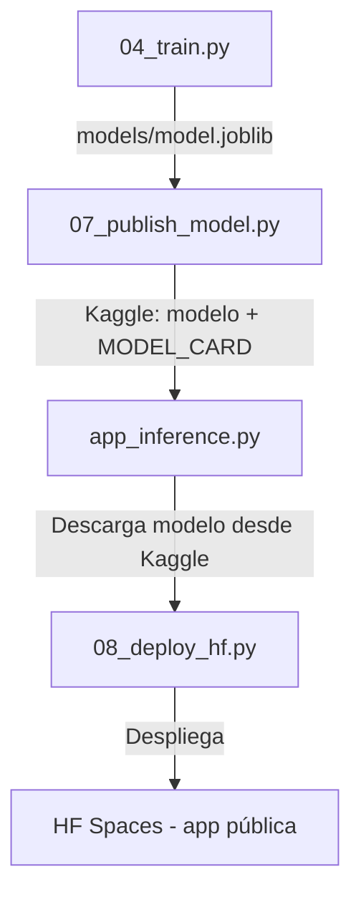
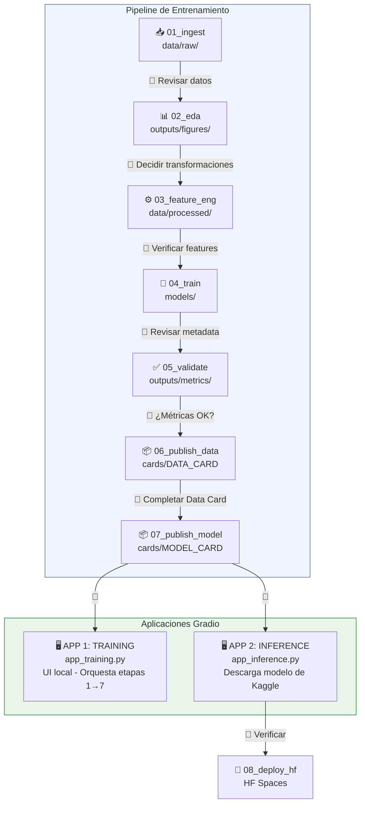

# Data Science Assistant

## Overview

Power integral para el desarrollo de aplicaciones de ciencia de datos y machine learning. Combina cuatro MCP servers (Tavily, Kaggle, Hugging Face y Gradio Docs) con documentación de workflows completos que cubren todo el ciclo de vida de un proyecto de datos.

Este power promueve una **arquitectura modular por etapas** donde cada fase del pipeline es un script independiente. Esto permite la intervención del científico de datos y del ingeniero de datos entre cada etapa, revisando resultados antes de avanzar.

## Principios Fundamentales

### Requisito: Fuente de Datos Explícita

**OBLIGATORIO**: Al iniciar cualquier proyecto de datos, el usuario DEBE proporcionar explícitamente la fuente de datos:

- **Si la fuente es Kaggle**: El nombre del dataset en formato `usuario/nombre-dataset` (ejemplo: `sims22/irisflowerdatasets`). PREGUNTAR si no lo proporciona.
- **Si la fuente es CSV local**: La ruta al archivo o directorio con los CSVs.
- **Si la fuente es API**: El endpoint y método de autenticación.

NUNCA asumir o inventar un dataset. El `config.yaml` se genera con estos datos según la fuente elegida.

### Licenciamiento: Apache 2.0

**OBLIGATORIO**: Todo dataset curado y modelo publicado a Kaggle DEBE usar licencia **Apache 2.0**. El valor canónico del proyecto es `Apache-2.0` (formato SPDX). Sin embargo, distintos sistemas requieren variantes de sintaxis del mismo nombre. Esto aplica a:
- `dataset-metadata.json` al publicar datasets
- `model-metadata.json` y `model-instance-metadata.json` al publicar modelos
- `cards/DATA_CARD.md`
- `cards/MODEL_CARD.md`

**IMPORTANTE — Variantes de sintaxis del nombre de licencia según sistema:**

| Contexto | Valor correcto | Ejemplo |
|----------|---------------|---------|
| `dataset-metadata.json` (CLI) | `"Apache 2.0"` (con espacio) | `"licenses": [{"name": "Apache 2.0"}]` |
| `model-instance-metadata.json` (CLI) | `"Apache 2.0"` (con espacio) | `"licenseName": "Apache 2.0"` |
| README.md / YAML frontmatter | `apache-2.0` (minúsculas, guión) | `license: apache-2.0` |
| config.yaml / documentación | `Apache-2.0` (SPDX canónico) | `license: "Apache-2.0"` |

Todas estas variantes representan la misma licencia. La diferencia es puramente de sintaxis: el CLI de Kaggle valida el nombre exacto con espacio, HF usa el formato SPDX en minúsculas, y el proyecto usa el formato SPDX estándar. Si usas `"Apache-2.0"` en los JSON de metadata de Kaggle, recibirás el error `"Specify an existing license"`. Usa siempre `"Apache 2.0"` con espacio en esos archivos.

### Gestión de Entorno: uv y uvx

**OBLIGATORIO**: Todo proyecto de datos DEBE usar `uv` como gestor de paquetes y entornos virtuales. NUNCA usar `pip o pip3 install` directamente ni `python -m venv`.

```bash
# Inicializar proyecto
uv init mi-proyecto-ml
cd mi-proyecto-ml

# Agregar dependencias
uv add pandas numpy matplotlib seaborn scikit-learn
uv add xgboost joblib pyyaml

# Para deep learning (elegir uno)
uv add tensorflow
# o
uv add torch torchvision

# Para la app de UI
uv add gradio

# Para publicar a Kaggle/HF
uv add kaggle huggingface-hub

# Ejecutar scripts
uv run python scripts/01_ingest.py
uv run python scripts/02_eda.py

# Ejecutar herramientas CLI
uvx kaggle datasets list -s "heart disease"
uvx huggingface-cli login
```

### Arquitectura Modular por Etapas

Cada proyecto DEBE seguir esta estructura de archivos separados. Cada script es una etapa independiente que produce artefactos consumidos por la siguiente. La intervención humana entre etapas es esperada y deseable.

```
mi-proyecto-ml/
├── pyproject.toml              # Dependencias gestionadas por uv
├── uv.lock                     # Lock file generado por uv
├── config.yaml                 # Configuración centralizada
├── README.md                   # Documentación del proyecto
├── data/
│   ├── raw/                    # Datos originales (NUNCA modificar)
│   ├── processed/              # Datos después de Feature Engineering
│   └── external/               # Datos de fuentes externas
├── scripts/
│   ├── 01_ingest.py            # Etapa 1: Ingesta de datos
│   ├── 02_eda.py               # Etapa 2: Análisis Exploratorio
│   ├── 03_feature_engineering.py  # Etapa 3: Feature Engineering
│   ├── 04_train.py             # Etapa 4: Entrenamiento → genera modelo .pkl/.joblib
│   ├── 05_validate.py          # Etapa 5: Validación con métricas
│   ├── 06_publish_dataset.py   # Etapa 6: Publicar dataset curado a Kaggle
│   ├── 07_publish_model.py     # Etapa 7: Publicar modelo a Kaggle
│   └── 08_deploy_hf.py         # Etapa 8: Desplegar app de inferencia a HF Spaces
├── models/                     # Modelos serializados (.pkl, .joblib, .keras, .pth)
├── outputs/
│   ├── figures/                # Gráficas de EDA y validación
│   ├── metrics/                # Métricas en JSON
│   └── reports/                # Reportes generados
├── cards/
│   ├── DATA_CARD.md            # Data Card del dataset curado
│   └── MODEL_CARD.md           # Model Card del modelo entrenado
├── app_training/               # APP 1: UI de Entrenamiento (pipeline completo)
│   └── app_training.py         # Gradio UI: ingesta → EDA → FE → train → validate → publish
├── app_inference/              # APP 2: UI de Inferencia (consume modelo de Kaggle)
│   ├── app_inference.py        # Gradio UI: carga modelo de Kaggle → predicción
│   ├── requirements.txt        # Deps para HF Spaces (versiones fijas)
│   └── README.md               # Metadata del Space (YAML frontmatter)
└── lib/
    ├── __init__.py
    ├── data_utils.py            # Funciones compartidas de datos
    ├── feature_utils.py         # Funciones de feature engineering
    ├── model_utils.py           # Funciones de entrenamiento/predicción
    └── plot_utils.py            # Funciones de visualización
```

### Dos Aplicaciones Gradio

El proyecto genera **dos aplicaciones Gradio separadas** con propósitos distintos:

| App | Archivo | Propósito | Usuario | Despliegue |
|-----|---------|-----------|---------|------------|
| **Training** | `app_training/app_training.py` | Pipeline completo: ingesta → EDA → FE → entrenamiento → validación → publicación | Científico de datos / Ingeniero de datos | Local (`uv run`) |
| **Inference** | `app_inference/app_inference.py` | Descarga modelo publicado en Kaggle y expone UI de predicción | Usuario final | Hugging Face Spaces |

La app de Training se ejecuta localmente y orquesta todas las etapas con intervención humana entre cada una. La app de Inference se despliega a HF Spaces y descarga el modelo directamente desde Kaggle.

**Flujo de publicación del modelo:**



El modelo en Kaggle es la **fuente de verdad**. La app de inferencia en HF Spaces SIEMPRE descarga el modelo desde Kaggle al iniciar. Esto garantiza que cualquier actualización del modelo en Kaggle se refleje automáticamente al reiniciar el Space.

### Flujo de Ejecución por Etapas



👤 = Punto de intervención humana (revisión, ajuste, aprobación)

Cada `👤` es un punto donde el científico de datos o ingeniero de datos revisa los artefactos producidos, ajusta parámetros en `config.yaml`, y decide si avanzar a la siguiente etapa.

### config.yaml Centralizado

```yaml
project:
  name: "mi-proyecto-ml"
  description: "Clasificación de..."
  author: "Gustavo De la Cruz Tovar"
  version: "1.0.0"
  license: "Apache-2.0"

data:
  source: "kaggle"                    # kaggle, csv, api
  kaggle_ref: "username/dataset-name" # OBLIGATORIO: usuario/nombre-dataset de Kaggle
  raw_path: "data/raw/"
  processed_path: "data/processed/"
  test_size: 0.2
  random_state: 42

features:
  numeric: ["age", "income", "score"]
  categorical: ["city", "gender"]
  target: "label"
  drop_columns: ["id", "timestamp"]

model:
  type: "random_forest"              # random_forest, xgboost, tensorflow, pytorch
  output_format: "joblib"            # joblib, pickle, keras, pth
  params:
    n_estimators: 200
    max_depth: 10
    random_state: 42

training:
  cv_folds: 5
  scoring: "accuracy"                # accuracy, f1, roc_auc, r2, rmse

publish:
  kaggle_username: "tu-username"
  kaggle_dataset_slug: "mi-dataset-curado"
  kaggle_model_slug: "mi-modelo"
  hf_username: "tu-username"
  hf_space_name: "mi-predictor-ml"
```

## Available Steering Files

Este power incluye guías detalladas por workflow. Carga solo la que necesites:

- **eda-feature-engineering** — Guía de EDA (02_eda.py) y Feature Engineering (03_feature_engineering.py) con pandas/numpy/matplotlib/seaborn/scipy/sklearn
- **model-training-validation** — Entrenamiento (04_train.py) y validación (05_validate.py) con sklearn, XGBoost, TensorFlow y PyTorch. Genera modelos en formato pickle/joblib
- **kaggle-workflows** — Ingesta (01_ingest.py), publicación de datasets curados (06_publish_dataset.py) con Data Card, y publicación de modelos (07_publish_model.py) con Model Card
- **gradio-interfaces** — Dos aplicaciones Gradio: app_training (pipeline completo con UI local) y app_inference (consume modelo de Kaggle, se despliega a HF Spaces)
- **mlops-deployment** — Pipelines MLOps, script de despliegue a HF Spaces (08_deploy_hf.py), y estructura del proyecto con uv

## MCP Servers Incluidos

### 1. Tavily MCP
Consulta documentación actualizada de cualquier librería de Python. Usa `tavily_skill` para buscar docs específicos:
```
query: "pandas DataFrame groupby aggregation"
library: "pandas"
language: "python"
```

Librerías cubiertas: pandas, numpy, matplotlib, seaborn, scipy, sklearn, tensorflow, pytorch, xgboost, gradio.

### 2. Kaggle MCP
Acceso directo a la plataforma Kaggle para:
- Buscar y descargar datasets (`search_datasets`, `download_dataset`)
- Buscar y explorar competencias
- Subir archivos individuales (`upload_dataset_file`)
- Actualizar metadata de datasets existentes (`update_dataset_metadata`)
- Crear modelos vacíos (`create_model`) y actualizar su metadata (`update_model`)
- Guardar y ejecutar notebooks (`save_notebook`)
- Explorar notebooks y benchmarks

**LIMITACIONES CRÍTICAS del MCP de Kaggle** (operaciones que requieren el CLI):

| Operación | MCP | CLI (`uv run kaggle`) |
|-----------|-----|----------------------|
| Buscar datasets | ✅ `search_datasets` | ✅ `kaggle datasets list` |
| Descargar datasets | ✅ `download_dataset` | ✅ `kaggle datasets download` |
| **Crear dataset nuevo** | ❌ No soportado | ✅ `kaggle datasets create -p carpeta/` |
| Actualizar metadata dataset | ✅ `update_dataset_metadata` | ✅ `kaggle datasets metadata` |
| Crear modelo (vacío) | ✅ `create_model` | ✅ `kaggle models create` |
| **Subir archivos a modelo** | ❌ No soportado | ✅ `kaggle models instances create -p carpeta/` |
| Guardar/ejecutar notebooks | ✅ `save_notebook` | ✅ `kaggle kernels push` |

**Estrategia recomendada**: Usa el MCP para buscar, explorar y descargar. Usa el CLI para crear y publicar.

### Credenciales de Kaggle: Dos Tipos Diferentes

Kaggle usa **dos tipos de credenciales** que NO son intercambiables:

| Tipo | Formato | Uso | Dónde obtenerlo |
|------|---------|-----|-----------------|
| **Token KGAT** | `KGAT_xxxx` | MCP de Kaggle (mcp.json) | https://www.kaggle.com/settings → API → Generate New Token |
| **API Key** | `{"username":"xxx","key":"xxx"}` | CLI de Kaggle (`~/.kaggle/kaggle.json`) | https://www.kaggle.com/settings → API → Create New API Token (descarga archivo) |

- El token KGAT va en `mcp.json` como `"Authorization: Bearer KGAT_xxxx"`
- El API Key se guarda en `~/.kaggle/kaggle.json` con permisos `chmod 600`
- Para publicar datasets y modelos necesitas **ambos**: KGAT para el MCP, API Key para el CLI
- En HF Spaces, configura `KAGGLE_USERNAME` y `KAGGLE_KEY` como secretos separados (no el KGAT)

### 3. Hugging Face MCP
Conexión al Hugging Face Hub para:
- Buscar modelos, datasets, Spaces y papers
- Buscar documentación de HF con lenguaje natural (PEFT, Transformers, Trainer, etc.)
- Ejecutar herramientas de Gradio Spaces compatibles con MCP
- Desplegar y gestionar Spaces

### 4. Gradio Docs MCP
Documentación oficial de Gradio con schemas exactos de componentes:
- Buscar docs de componentes específicos (`search_gradio_docs`)
- Cargar documentación completa (`load_gradio_docs`)
- Parámetros exactos, tipos y valores por defecto de cada componente

## Librerías de Referencia Rápida

| Librería | Uso Principal | Import |
|----------|--------------|--------|
| pandas | Manipulación de datos tabulares | `import pandas as pd` |
| numpy | Operaciones numéricas y arrays | `import numpy as np` |
| matplotlib | Visualización base | `import matplotlib.pyplot as plt` |
| seaborn | Visualización estadística | `import seaborn as sns` |
| scipy | Funciones científicas y estadísticas | `from scipy import stats` |
| sklearn | ML clásico, preprocesamiento, métricas | `from sklearn.model_selection import train_test_split` |
| xgboost | Gradient boosting de alto rendimiento | `import xgboost as xgb` |
| tensorflow | Deep learning (Keras API) | `import tensorflow as tf` |
| pytorch | Deep learning flexible | `import torch` |
| gradio | Interfaces web para modelos ML | `import gradio as gr` |

## Best Practices

- **uv siempre**: Usa `uv run` para ejecutar scripts, `uv add` para dependencias, `uvx` para CLI tools
- **Modularidad**: Cada etapa es un script independiente. NUNCA mezclar ingesta con entrenamiento en un solo archivo
- **Intervención humana**: Entre cada etapa, el científico/ingeniero revisa artefactos y ajusta config.yaml
- **Data leakage**: NUNCA hagas fit del scaler/imputer con datos de test
- **Serialización**: Usa joblib/pickle para sklearn/XGBoost, .keras para TensorFlow, .pth para PyTorch
- **Cards obligatorias**: Siempre genera DATA_CARD.md al publicar datasets y MODEL_CARD.md al publicar modelos
- **Versionado**: Versiona datasets y modelos en Kaggle con mensajes descriptivos
- **Config centralizado**: Todos los parámetros en config.yaml, nunca hardcodeados en scripts
- **XGBoost + cross_val_score**: NUNCA uses `early_stopping_rounds` en el modelo que pasas a `cross_val_score()` — falla porque no recibe `eval_set`. Usa un modelo separado sin early stopping para CV, y otro con early stopping para el entrenamiento final
- **XGBoost en macOS**: Requiere OpenMP runtime. Instalar con `brew install libomp` antes de usar XGBoost
- **Gradio en HF Spaces**: Verifica la versión actual de Gradio antes de configurar `sdk_version` en el README.md del Space. Usa `uv run python -c "import gradio; print(gradio.__version__)"` para obtener la versión instalada. Versiones inexistentes causan `configuration error`

## Troubleshooting

### uv no encontrado
```bash
# Instalar uv
curl -LsSf https://astral.sh/uv/install.sh | sh
# Verificar
uv --version
```

### XGBoost falla en macOS con "libomp not found"
```bash
# XGBoost requiere OpenMP runtime en macOS
brew install libomp
```

### XGBoost + cross_val_score falla con "Must have at least 1 validation dataset"
El modelo tiene `early_stopping_rounds` configurado, que requiere `eval_set`. `cross_val_score` no pasa `eval_set`. Solución: usar dos modelos separados:
```python
# Modelo para CV (SIN early stopping)
xgb_cv = xgb.XGBClassifier(n_estimators=200, max_depth=4, random_state=42, eval_metric='mlogloss')
cv_scores = cross_val_score(xgb_cv, X, y, cv=5, scoring='accuracy')

# Modelo final (CON early stopping)
xgb_final = xgb.XGBClassifier(n_estimators=200, max_depth=4, random_state=42,
                                eval_metric='mlogloss', early_stopping_rounds=20)
xgb_final.fit(X_train, y_train, eval_set=[(X_test, y_test)])
```

### Kaggle CLI: "401 Unauthorized" al publicar
El CLI necesita API Key (username+key), NO el token KGAT del MCP. Descarga `kaggle.json` desde https://www.kaggle.com/settings → API → Create New API Token, y cópialo a `~/.kaggle/kaggle.json` con `chmod 600`.

### Kaggle CLI: "Specify an existing license"
El nombre de licencia debe ser exacto. Usa `"Apache 2.0"` (con espacio), NO `"Apache-2.0"` ni `"CC0-1.0"`.

### Kaggle MCP: "Permission denied" al crear dataset
El MCP de Kaggle NO puede crear datasets nuevos. Usa el CLI: `uv run kaggle datasets create -p carpeta/`.

### HF Spaces: "Gradio version does not exist"
La versión de Gradio en `sdk_version` del README.md no existe. Verifica la versión actual:
```bash
uv run python -c "import gradio; print(gradio.__version__)"
```
Usa esa versión exacta en el README.md del Space.

### Kaggle MCP no conecta
1. Verifica que tu token comience con "KGAT"
2. Genera un nuevo token en https://www.kaggle.com/settings > Generate New Token
3. Reemplaza `YOUR_KAGGLE_TOKEN` en mcp.json

### Hugging Face MCP no conecta
1. Genera un token en https://huggingface.co/settings/tokens
2. Asegúrate de que el token tenga permisos de lectura (mínimo)
3. Reemplaza `YOUR_HF_TOKEN` en mcp.json
4. Configura tus tools en https://huggingface.co/settings/mcp

### Tavily no devuelve resultados relevantes
1. Usa el parámetro `library` para acotar la búsqueda
2. Sé específico en el query
3. Usa `language: "python"` siempre

## MCP Config Placeholders

Antes de usar este power, reemplaza los siguientes placeholders en `mcp.json`:

- **`YOUR_TAVILY_API_KEY`**: Tu API key de Tavily.
  - **Cómo obtenerla:** Ve a https://app.tavily.com, crea cuenta y copia tu API key

- **`YOUR_KAGGLE_TOKEN`**: Tu token KGAT de Kaggle (comienza con "KGAT"). Este token es SOLO para el MCP.
  - **Cómo obtenerlo:** Ve a https://www.kaggle.com/settings > Generate New Token
  - **IMPORTANTE**: Este token NO sirve para el CLI de Kaggle. Para publicar datasets/modelos necesitas además el API Key (ver sección "Credenciales de Kaggle").

- **`YOUR_HF_TOKEN`**: Tu token de Hugging Face.
  - **Cómo obtenerlo:** Ve a https://huggingface.co/settings/tokens > New token con permisos de lectura

### Configurar Kaggle CLI (necesario para publicar)

Además del token KGAT para el MCP, necesitas configurar el CLI de Kaggle para publicar datasets y modelos:

```bash
# 1. Descargar kaggle.json desde https://www.kaggle.com/settings → API → Create New API Token
# 2. Copiar a ~/.kaggle/
cp ~/Downloads/kaggle.json ~/.kaggle/kaggle.json
chmod 600 ~/.kaggle/kaggle.json

# 3. Verificar
uv run kaggle datasets list -s "iris" --max-size 1
```

---

**MCP Servers:** tavily-mcp, kaggle, huggingface, gradio-docs
