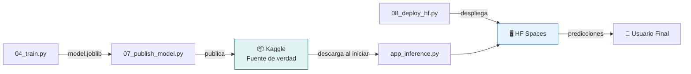

# MLOps Pipelines y Despliegue

## Inicialización del Proyecto con uv

### Crear Proyecto Nuevo

```bash
# Crear proyecto
uv init mi-proyecto-ml
cd mi-proyecto-ml

# Agregar dependencias base
uv add pandas numpy matplotlib seaborn scikit-learn joblib pyyaml

# Dependencias opcionales según el modelo
uv add xgboost                    # Para XGBoost
uv add tensorflow                 # Para TensorFlow
uv add torch torchvision          # Para PyTorch

# Dependencias para publicación
uv add kaggle huggingface-hub

# Dependencias para las apps
uv add gradio

# Crear estructura de directorios
mkdir -p data/raw data/processed data/external
mkdir -p scripts models outputs/figures outputs/metrics outputs/reports
mkdir -p cards app_training app_inference lib
touch lib/__init__.py
```

### pyproject.toml de Referencia

```toml
[project]
name = "mi-proyecto-ml"
version = "0.1.0"
description = "Proyecto de ciencia de datos"
readme = "README.md"
requires-python = ">=3.11"
dependencies = [
    "pandas>=2.2",
    "numpy>=1.26",
    "matplotlib>=3.9",
    "seaborn>=0.13",
    "scikit-learn>=1.5",
    "xgboost>=2.1",
    "joblib>=1.4",
    "pyyaml>=6.0",
    "gradio>=6.0",
    "kaggle>=1.6",
    "huggingface-hub>=0.25",
]
```

### Ejecutar las Dos Apps

```bash
# APP 1: Training Pipeline (local, para el científico de datos)
uv run python app_training/app_training.py
# Abre http://localhost:7860 — ejecuta etapas secuencialmente

# APP 2: Inference (local para probar, luego deploy a HF)
uv run python app_inference/app_inference.py
# Abre http://localhost:7861 — prueba predicciones antes de desplegar
```

### Ejecutar Etapas por CLI (alternativa sin UI)

```bash
uv run python scripts/01_ingest.py
# 👤 Revisar data/raw/

uv run python scripts/02_eda.py
# 👤 Revisar outputs/figures/ y outputs/reports/

uv run python scripts/03_feature_engineering.py
# 👤 Revisar data/processed/

uv run python scripts/04_train.py
# 👤 Revisar outputs/metrics/train_metadata.json

uv run python scripts/05_validate.py
# 👤 Revisar outputs/metrics/validation.json y outputs/figures/

uv run python scripts/06_publish_dataset.py
# 👤 Completar cards/DATA_CARD.md → upload manual con uvx kaggle

uv run python scripts/07_publish_model.py
# 👤 Completar cards/MODEL_CARD.md → upload manual con uvx kaggle

uv run python scripts/08_deploy_hf.py
# 👤 Verificar Space en HF
```

---

## Etapa 8: Script 08_deploy_hf.py — Desplegar App de Inferencia

Este script despliega la app de inferencia (`app_inference/`) a Hugging Face Spaces. La app de training NO se despliega — es solo para uso local.

**Patrón probado** (basado en implementación real de salary-predictor):
- Usa `HfApi` con token desde variable de entorno `HF_TOKEN`
- Configura el token de Kaggle como **secreto del Space** (`add_space_secret`) para que la app descargue el modelo en runtime
- Usa `ignore_patterns` en `upload_folder` para excluir scripts de entrenamiento y artefactos locales
- Solo sube los archivos necesarios para la app de inferencia

### Requisitos Previos

```bash
# 1. Token de Hugging Face con permisos de escritura
export HF_TOKEN=hf_xxx
# Genéralo en: https://huggingface.co/settings/tokens

# 2. Credenciales de Kaggle para el Space (username + key, NO el token KGAT)
# El Space necesita descargar el modelo desde Kaggle en runtime.
# Configura KAGGLE_USERNAME y KAGGLE_KEY como secretos separados del Space.
# Obtén el API Key en: https://www.kaggle.com/settings → API → Create New API Token
# El archivo descargado contiene {"username":"xxx","key":"xxx"}
```

**IMPORTANTE sobre credenciales de Kaggle en HF Spaces:**
- NO uses el token KGAT del MCP. El CLI de Kaggle dentro del Space necesita username+key.
- Configura dos secretos separados: `KAGGLE_USERNAME` y `KAGGLE_KEY`.
- La app de inferencia debe crear `~/.kaggle/kaggle.json` desde estas variables de entorno al iniciar:

```python
import os, json

def setup_kaggle_credentials():
    """Crea ~/.kaggle/kaggle.json desde variables de entorno del Space."""
    kaggle_dir = os.path.expanduser("~/.kaggle")
    kaggle_json = os.path.join(kaggle_dir, "kaggle.json")
    if not os.path.exists(kaggle_json):
        username = os.environ.get("KAGGLE_USERNAME", "")
        key = os.environ.get("KAGGLE_KEY", "")
        if username and key:
            os.makedirs(kaggle_dir, exist_ok=True)
            with open(kaggle_json, "w") as f:
                json.dump({"username": username, "key": key}, f)
            os.chmod(kaggle_json, 0o600)
```

### Estructura del Script

```python
#!/usr/bin/env python3
"""08_deploy_hf.py — Desplegar app de inferencia a Hugging Face Spaces.

Crea el Space, configura el secreto de Kaggle, y sube solo los archivos
de la app de inferencia. El modelo NO se sube — la app lo descarga
desde Kaggle al iniciar usando el secreto KAGGLE_API_TOKEN.

Uso: HF_TOKEN=hf_xxx KAGGLE_API_TOKEN=KGAT_xxx uv run python scripts/08_deploy_hf.py
"""
import os
import yaml
from pathlib import Path
from huggingface_hub import HfApi

# Cargar configuración
with open("config.yaml") as f:
    config = yaml.safe_load(f)

HF_TOKEN = os.environ.get("HF_TOKEN")

if not HF_TOKEN:
    raise ValueError(
        "Falta HF_TOKEN. Expórtalo:\n"
        "  export HF_TOKEN=hf_xxx\n"
        "Genéralo en: https://huggingface.co/settings/tokens"
    )

hf_username = config["publish"]["hf_username"]
space_name = config["publish"]["hf_space_name"]
repo_id = f"{hf_username}/{space_name}"
kaggle_model_ref = f"{config['publish']['kaggle_username']}/{config['publish']['kaggle_model_slug']}"

api = HfApi(token=HF_TOKEN)

# --- 1. Crear Space si no existe ---
api.create_repo(
    repo_id=repo_id,
    repo_type="space",
    space_sdk="gradio",
    private=False,
    exist_ok=True,
)
print(f"✅ Space verificado: {repo_id}")

# --- 2. Configurar secretos de Kaggle en el Space ---
# La app necesita KAGGLE_USERNAME y KAGGLE_KEY (NO el token KGAT)
# para crear ~/.kaggle/kaggle.json y descargar el modelo en runtime
kaggle_username = config["publish"]["kaggle_username"]
kaggle_key = os.environ.get("KAGGLE_KEY")

if kaggle_username:
    api.add_space_secret(repo_id=repo_id, key="KAGGLE_USERNAME", value=kaggle_username)
    print("✅ Secreto KAGGLE_USERNAME configurado en el Space")

if kaggle_key:
    api.add_space_secret(repo_id=repo_id, key="KAGGLE_KEY", value=kaggle_key)
    print("✅ Secreto KAGGLE_KEY configurado en el Space")
else:
    print("⚠️  KAGGLE_KEY no proporcionado — configúralo manualmente en:")
    print(f"   https://huggingface.co/spaces/{repo_id}/settings")
    print("   Obtén el key de ~/.kaggle/kaggle.json (campo 'key')")

# --- 3. Configurar referencia del modelo como secreto ---
api.add_space_secret(repo_id=repo_id, key="KAGGLE_MODEL_REF", value=kaggle_model_ref)
print(f"✅ Secreto KAGGLE_MODEL_REF configurado: {kaggle_model_ref}")

# --- 4. Subir archivos de la app de inferencia ---
# Solo sube app_inference/, excluyendo scripts de entrenamiento y artefactos locales
app_dir = Path("app_inference")

api.upload_folder(
    folder_path=str(app_dir),
    repo_id=repo_id,
    repo_type="space",
    ignore_patterns=[
        "__pycache__/*",
        "*.pyc",
    ],
)

print(f"\n✅ App desplegada en: https://huggingface.co/spaces/{repo_id}")
print(f"\n👤 SIGUIENTE:")
print(f"   1. Verifica que el Space funciona: https://huggingface.co/spaces/{repo_id}")
print(f"   2. Si necesitas más secretos, configúralos en:")
print(f"      https://huggingface.co/spaces/{repo_id}/settings")
```

### Patrones Clave del Despliegue

**1. Secretos en lugar de archivos**: El token de Kaggle se configura como secreto del Space con `add_space_secret()`, nunca se sube como archivo. La app de inferencia lee `os.environ.get("KAGGLE_API_TOKEN")` en runtime.

**2. Modelo NO se sube al Space**: La app descarga el modelo desde Kaggle al iniciar. Esto significa:
- El Space es liviano (solo código Python + requirements.txt)
- Actualizar el modelo en Kaggle = reiniciar Space = modelo actualizado
- No se necesita re-desplegar para cambiar el modelo

**3. ignore_patterns**: Al subir con `upload_folder`, se excluyen archivos que no deben estar en el Space:
```python
ignore_patterns=[
    "train.py",           # Scripts de entrenamiento
    "deploy_to_hf.py",   # Este mismo script
    "upload_to_kaggle.py", # Script de publicación
    "outputs/*",          # Artefactos locales
    "kaggle-model/*",     # Cache local de Kaggle
    "kaggle-upload/*",    # Directorio de upload
    "__pycache__/*",      # Cache de Python
    "model.joblib",       # Modelo local (se descarga de Kaggle)
]
```

**4. Ejecución con variables de entorno**:
```bash
# Todo en un comando
HF_TOKEN=hf_xxx KAGGLE_API_TOKEN=KGAT_xxx uv run python scripts/08_deploy_hf.py
```

### Autenticación previa

```bash
# Login en Hugging Face (una sola vez, alternativa a variable de entorno)
uvx huggingface-cli login
```

---

## Tracking de Experimentos (Lightweight)

```python
# En lib/data_utils.py
import json
from datetime import datetime
from pathlib import Path

def log_experiment(model_name, params, metrics, notes=""):
    """Registra un experimento en formato JSONL."""
    experiment = {
        "timestamp": datetime.now().isoformat(),
        "model": model_name,
        "params": params,
        "metrics": metrics,
        "notes": notes
    }

    log_file = Path("outputs/reports/experiment_log.jsonl")
    log_file.parent.mkdir(parents=True, exist_ok=True)

    with open(log_file, "a") as f:
        f.write(json.dumps(experiment, default=str) + "\n")

    print(f"📝 Experimento registrado: {model_name}")
```

---

## Resumen de las Dos Apps

| Aspecto | App Training | App Inference |
|---------|-------------|---------------|
| Archivo | `app_training/app_training.py` | `app_inference/app_inference.py` |
| Propósito | Pipeline completo de ML | Predicción con modelo de Kaggle |
| Usuario | Científico/Ingeniero de datos | Usuario final |
| Ejecución | `uv run python app_training/app_training.py` | `uv run python app_inference/app_inference.py` |
| Despliegue | Solo local | Hugging Face Spaces |
| Tabs | Ingesta, EDA, FE, Train, Validate, Publish | Predicción individual, Lotes, Info |
| Fuente del modelo | Entrena y guarda localmente | **Descarga desde Kaggle** |
| Intervención | 👤 Entre cada etapa | Ninguna (usuario final) |

### Flujo del Modelo: Kaggle → HF Spaces



**Kaggle es el repositorio central del modelo.** La app de inferencia en HF Spaces descarga el modelo desde Kaggle cada vez que el Space se inicia o reinicia. Esto significa que:
- Publicar una nueva versión del modelo en Kaggle → reiniciar el Space → la app usa el modelo actualizado
- No se necesita re-desplegar la app para actualizar el modelo
- El modelo en Kaggle incluye MODEL_CARD.md con métricas, hiperparámetros y limitaciones

## Checklist de Despliegue

- [ ] App de training probada localmente: `uv run python app_training/app_training.py`
- [ ] Modelo y preprocessor publicados en Kaggle
- [ ] App de inferencia probada localmente: `uv run python app_inference/app_inference.py`
- [ ] `app_inference/requirements.txt` con versiones fijas (`==`)
- [ ] `app_inference/README.md` con `sdk_version` que coincida con la versión de Gradio instalada
- [ ] `cards/DATA_CARD.md` completada
- [ ] `cards/MODEL_CARD.md` completada
- [ ] `uvx huggingface-cli login` ejecutado
- [ ] `uv run python scripts/08_deploy_hf.py` ejecutado
- [ ] Space verificado en navegador
- [ ] Secrets configurados en HF Spaces: `KAGGLE_USERNAME` y `KAGGLE_KEY` (NO el token KGAT)

## Gotchas

- HF Spaces tiene límite de 10GB. Para modelos grandes, descárgalos en runtime desde Kaggle
- **Verificar versión de Gradio**: Usa `uv run python -c "import gradio; print(gradio.__version__)"` y pon esa versión exacta en `sdk_version` del README.md del Space. Versiones inexistentes causan `configuration error: Gradio version does not exist`
- **Credenciales de Kaggle en Spaces**: Usa `KAGGLE_USERNAME` + `KAGGLE_KEY` como secretos separados (NO el token KGAT). La app debe crear `~/.kaggle/kaggle.json` desde estas variables al iniciar
- **`model_instance_version_download`**: Recibe UN SOLO string `"owner/model/framework/variation/version"`, NO argumentos separados. Error común que causa `TypeError: got multiple values for argument`
- Variables secretas se configuran en Settings > Repository Secrets del Space
- El Space se reconstruye con cada push a main
- Usa `uv run kaggle` o `uvx kaggle` para CLI tools en lugar de instalarlos globalmente
- La app de training NUNCA se despliega — es solo para uso local del equipo de datos
