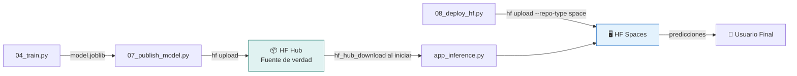

# MLOps Pipelines y Despliegue

## Inicialización del Proyecto con uv

### Crear Proyecto Nuevo

```bash
# Crear proyecto
uv init mi-proyecto-ml
cd mi-proyecto-ml

# Agregar dependencias base
uv add pandas numpy matplotlib seaborn scikit-learn joblib pyyaml

# Dependencias opcionales según el modelo
uv add xgboost                    # Para XGBoost
uv add tensorflow                 # Para TensorFlow
uv add torch torchvision          # Para PyTorch

# Dependencias para publicación e interacción con HF
# IMPORTANTE: huggingface-hub>=0.28.1 es requerido por gradio>=5.31.
# Si usas gradio<5.31 puedes bajar la cota, pero por defecto fija 0.28.1+.
uv add "huggingface-hub>=0.28.1"

# Dependencias para las apps
uv add gradio

# Crear estructura de directorios
mkdir -p data/raw data/processed data/external
mkdir -p scripts models outputs/figures outputs/metrics outputs/reports
mkdir -p cards app_results app_inference lib
touch lib/__init__.py
```

### pyproject.toml de Referencia

```toml
[project]
name = "mi-proyecto-ml"
version = "0.1.0"
description = "Proyecto de ciencia de datos"
readme = "README.md"
requires-python = ">=3.11"
dependencies = [
    "pandas>=2.2",
    "numpy>=1.26",
    "matplotlib>=3.9",
    "seaborn>=0.13",
    "scikit-learn>=1.5",
    "xgboost>=2.1",
    "joblib>=1.4",
    "pyyaml>=6.0",
    "gradio>=5.31",
    "huggingface-hub>=0.28.1",  # gradio>=5.31 requiere >=0.28.1; NUNCA bajar a 0.25
]
```

### Ejecutar las Dos Apps

```bash
# APP 1: Dashboard de Resultados (local, solo visualización)
uv run python app_results/app_results.py
# Abre http://localhost:7860 — muestra figuras de EDA, hiperparámetros del
# modelo entrenado y métricas de validación. NO ejecuta scripts, solo lee
# de outputs/.

# APP 2: Inference (local para probar, luego deploy a HF)
uv run python app_inference/app_inference.py
# Abre http://localhost:7861 — prueba predicciones antes de desplegar
```

> El pipeline de entrenamiento se ejecuta vía CLI script por script (ver más abajo).
> El dashboard `app_results` no orquesta nada: solo expone los artefactos generados.

### Ejecutar Etapas por CLI (alternativa sin UI)

```bash
uv run python scripts/01_ingest.py
# 👤 Revisar data/raw/

uv run python scripts/02_eda.py
# 👤 Revisar outputs/figures/ y outputs/reports/

uv run python scripts/03_feature_engineering.py
# 👤 Revisar data/processed/

uv run python scripts/04_train.py
# 👤 Revisar outputs/metrics/train_metadata.json

uv run python scripts/05_validate.py
# 👤 Revisar outputs/metrics/validation.json y outputs/figures/

uv run python scripts/06_publish_dataset.py
# 👤 Completar cards/DATA_CARD.md → sube a HF Hub

uv run python scripts/07_publish_model.py
# 👤 Completar cards/MODEL_CARD.md → sube a HF Hub

uv run python scripts/08_deploy_hf.py
# 👤 Verificar Space en HF
```

---

## Etapa 8: Script 08_deploy_hf.py — Desplegar App de Inferencia

Este script despliega la app de inferencia (`app_inference/`) a Hugging Face Spaces usando el CLI `hf`. La app de training NO se despliega — es solo para uso local.

> **Regla**: el script `08_deploy_hf.py` **solo sube** archivos. No genera, no modifica, no escribe código de la app. Los archivos `app_inference/app_inference.py`, `app_inference/requirements.txt` y `app_inference/README.md` se editan directamente como archivos planos. Ver `gradio-interfaces.md` §Regla 0.

### Requisitos Previos

```bash
# 1. Estar autenticado en HF con permisos de escritura
hf auth login
hf auth whoami

# 2. Tener la app de inferencia lista en app_inference/
# Archivos mínimos: app_inference.py, requirements.txt, README.md
```

### Estructura del Script

```python
#!/usr/bin/env python3
"""08_deploy_hf.py — Desplegar app de inferencia a Hugging Face Spaces.

Crea el Space y sube los archivos de la app de inferencia usando hf CLI.
El modelo se descarga desde HF Hub en runtime (no se sube al Space).

Uso: uv run python scripts/08_deploy_hf.py
"""
import yaml
import subprocess
from pathlib import Path

# Cargar configuración
with open("config.yaml") as f:
    config = yaml.safe_load(f)

hf_username = config["publish"]["hf_username"]
space_name = config["publish"]["hf_space_name"]
repo_id = f"{hf_username}/{space_name}"
model_repo = f"{hf_username}/{config['publish']['hf_model_slug']}"

# --- 1. Crear Space si no existe ---
print(f"Creando Space: {repo_id}")
result = subprocess.run([
    "hf", "repos", "create", repo_id,
    "--repo-type", "space",
    "--space-sdk", "gradio",
    "--exist-ok"
], capture_output=True, text=True)

if result.returncode != 0:
    print(f"⚠️  {result.stderr.strip()}")
else:
    print(f"✅ Space verificado: {repo_id}")

# --- 2. Verificar que app_inference/ existe ---
app_dir = Path("app_inference")
if not app_dir.exists():
    print("❌ No se encontró app_inference/")
    print("   Crea la carpeta con: app_inference.py, requirements.txt, README.md")
    exit(1)

required_files = ["app_inference.py", "requirements.txt", "README.md"]
for f in required_files:
    if not (app_dir / f).exists():
        print(f"⚠️  Falta: app_inference/{f}")

# --- 3. Subir archivos al Space ---
print(f"\nSubiendo app de inferencia a Space...")
result = subprocess.run([
    "hf", "upload", repo_id,
    str(app_dir), ".",
    "--repo-type", "space",
    "--commit-message", f"Deploy app de inferencia (modelo: {model_repo})"
], capture_output=True, text=True)

if result.returncode == 0:
    print(f"\n✅ App desplegada en:")
    print(f"   https://huggingface.co/spaces/{repo_id}")
    print(f"\n👤 SIGUIENTE:")
    print(f"   1. Espera ~1 min a que el Space se construya")
    print(f"   2. Verifica que funciona: https://huggingface.co/spaces/{repo_id}")
    print(f"   3. Si necesitas secretos, configúralos en Settings del Space")
else:
    print(f"❌ Error: {result.stderr}")
    print("Asegúrate de estar autenticado: hf auth login")
```

### Patrones Clave del Despliegue

**1. Modelo NO se sube al Space**: La app descarga el modelo desde HF Hub al iniciar usando `huggingface_hub`. Esto significa:
- El Space es liviano (solo código Python + requirements.txt)
- Actualizar el modelo en HF Hub + reiniciar Space = modelo actualizado
- No se necesita re-desplegar para cambiar el modelo

**2. Estructura mínima de app_inference/**:
```
app_inference/
├── app_inference.py      # App de Gradio (archivo principal)
├── requirements.txt      # Dependencias con versiones fijas
└── README.md             # Metadata del Space (YAML frontmatter)
```

**3. README.md del Space** (obligatorio con este formato):
```markdown
---
title: Mi Predictor ML
emoji: 🔮
colorFrom: blue
colorTo: purple
sdk: gradio
sdk_version: "5.31.0"
app_file: app_inference.py
pinned: false
license: apache-2.0
---
```

**4. Descargar modelo en la app de inferencia**:
```python
from huggingface_hub import hf_hub_download
import joblib

# Se descarga al cache de HF automáticamente
model_path = hf_hub_download("usuario/mi-modelo", "model.joblib")
model = joblib.load(model_path)
```

**5. Actualizar el Space después de cambios**:
```bash
# Simplemente vuelve a subir — sobreescribe los archivos
hf upload usuario/mi-app ./app_inference/ . --repo-type space --commit-message "Fix: actualizar UI"
```

---

## Tracking de Experimentos (Lightweight)

```python
# En lib/data_utils.py
import json
from datetime import datetime
from pathlib import Path

def log_experiment(model_name, params, metrics, notes=""):
    """Registra un experimento en formato JSONL."""
    experiment = {
        "timestamp": datetime.now().isoformat(),
        "model": model_name,
        "params": params,
        "metrics": metrics,
        "notes": notes
    }

    log_file = Path("outputs/reports/experiment_log.jsonl")
    log_file.parent.mkdir(parents=True, exist_ok=True)

    with open(log_file, "a") as f:
        f.write(json.dumps(experiment, default=str) + "\n")

    print(f"📝 Experimento registrado: {model_name}")
```

---

## Resumen de las Dos Apps

| Aspecto | App Results | App Inference |
|---------|-------------|---------------|
| Archivo | `app_results/app_results.py` | `app_inference/app_inference.py` |
| Propósito | Dashboard de resultados (EDA + modelo + validación) | Predicción con modelo de HF Hub |
| Usuario | Científico/Ingeniero de datos | Usuario final |
| Ejecución | `uv run python app_results/app_results.py` | `uv run python app_inference/app_inference.py` |
| Despliegue | Solo local | Hugging Face Spaces (`hf upload`) |
| Tabs | EDA, Modelo (hiperparámetros), Validación | Predicción individual, Lotes, Info |
| Fuente de datos | Lee `outputs/figures/`, `outputs/metrics/`, `outputs/reports/` | **Descarga modelo desde HF Hub** |
| ¿Ejecuta scripts? | No, solo visualiza artefactos | No, solo predice (usuario final) |

### Flujo del Modelo: HF Hub → HF Spaces



**HF Hub es el repositorio central del modelo.** La app de inferencia en HF Spaces descarga el modelo desde HF Hub cada vez que el Space se inicia o reinicia.

## Checklist de Despliegue

- [ ] `hf auth whoami` confirma que estás autenticado
- [ ] Pipeline de entrenamiento ejecutado completo (scripts 01–05) y artefactos en `outputs/`
- [ ] Dashboard de resultados probado localmente: `uv run python app_results/app_results.py`
- [ ] Modelo publicado en HF Hub: `hf upload usuario/modelo ./models/ .`
- [ ] App de inferencia probada localmente: `uv run python app_inference/app_inference.py`
- [ ] App de inferencia usa el patrón condicional `port = 7860 if os.environ.get("SPACE_ID") else 7861` y `server_name="0.0.0.0"` en `launch()` (obligatorio para HF Spaces)
- [ ] `app_inference/app_inference.py` NO contiene `server_port=7861` hardcoded fuera de la rama condicional
- [ ] `app_inference/requirements.txt` con versiones consistentes: `huggingface-hub>=0.28.1` (rango, NUNCA `==0.25.0`), `gradio` con rango compatible
- [ ] `pip install --dry-run -r app_inference/requirements.txt` resuelve sin error
- [ ] `app_inference/README.md` con `sdk_version` que coincida con la versión de Gradio realmente instalada
- [ ] `cards/DATA_CARD.md` completada
- [ ] `cards/MODEL_CARD.md` completada
- [ ] `uv run python scripts/08_deploy_hf.py` ejecutado
- [ ] Space verificado en navegador (esperar ~1 min al build)

## Gotchas

- **⚠️ Puerto obligatorio en HF Spaces: 7860** — El contenedor de HF Spaces SOLO expone el puerto 7860. La app de inferencia DEBE usar el patrón condicional `port = 7860 if os.environ.get("SPACE_ID") else 7861` y `server_name="0.0.0.0"`. NUNCA hardcodear `server_port=7861` aunque localmente se use ese puerto para evitar conflictos con `app_results`. Si el código que se sube al Space tiene un puerto distinto de 7860, el Space falla en runtime con `OSError: Cannot find empty port in range`. Ver `gradio-interfaces.md` §"Errores Documentados en HF Spaces" → Error 1.
- **⚠️ Conflicto `huggingface-hub` vs `gradio` en `requirements.txt`** — `gradio>=5.31` exige `huggingface-hub>=0.28.1`. NO pinear `huggingface-hub==0.25.0` en `app_inference/requirements.txt` — pip falla con `ResolutionImpossible` al construir el Space. Usar siempre `huggingface-hub>=0.28.1` (rango, no pin estricto). Ver `gradio-interfaces.md` §"Errores Documentados en HF Spaces" → Error 2.
- **Validar localmente antes de subir** — Ejecutar `pip install --dry-run -r app_inference/requirements.txt` (o `uv pip compile`) ANTES de `08_deploy_hf.py`. Si el resolver falla en local, falla en Spaces y consume tiempo de cola.
- HF Spaces tiene límite de 10GB para repos. Para modelos grandes, descárgalos en runtime con `hf_hub_download`
- **Verificar versión de Gradio**: Usa `uv run python -c "import gradio; print(gradio.__version__)"` y pon esa versión exacta en `sdk_version` del README.md del Space
- El Space se reconstruye con cada push (cada `hf upload`)
- Si necesitas variables secretas (API keys), configúralas en Settings > Repository Secrets del Space
- El dashboard `app_results` NUNCA se despliega — es solo para uso local del equipo de datos
- Para modelos privados, la app necesita un token HF configurado como secreto del Space
